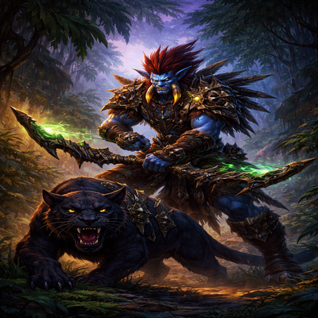
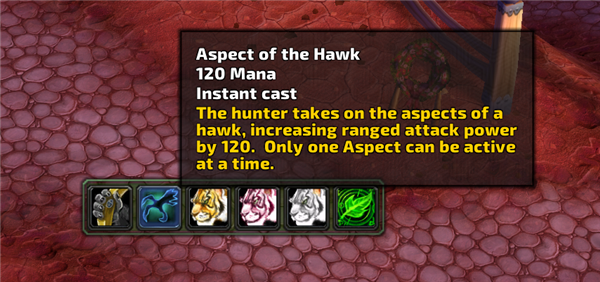
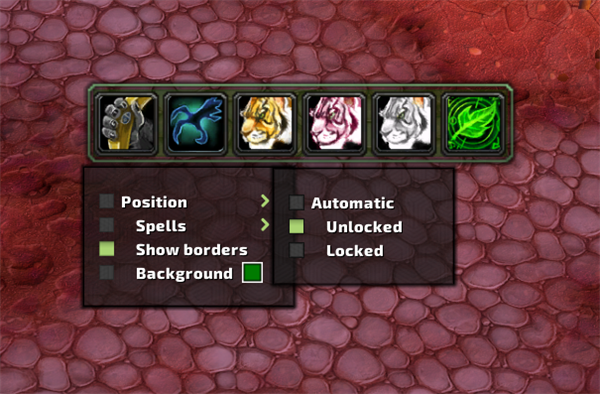
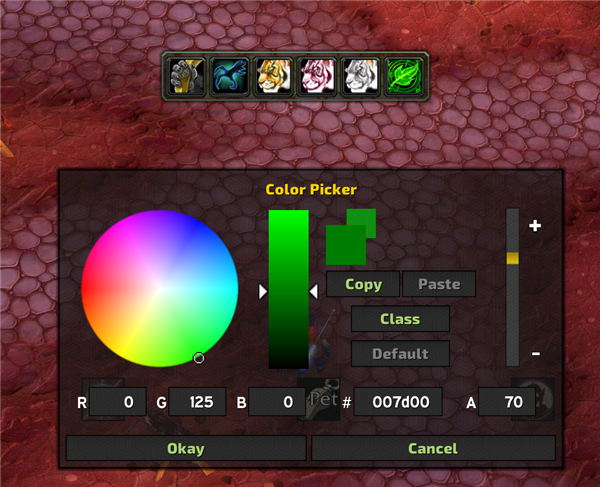

  

<h1 align="center" style="color:#AAD372;">FloAspectBar — TBC Classic Anniversary</h1>

A Hunter aspect bar addon for **WoW TBC Classic Anniversary** (Interface 20505). Displays all 7 Hunter aspects as clickable buttons with cooldown tracking and keybinding support.

Originally created by **Floraline** (MPL 2.0). Ported to TBC Classic Anniversary by **paradosi-Dreamscythe**.

## Features

- **7 Hunter Aspects** — Monkey, Hawk, Viper, Cheetah, Beast, Pack, Wild
- **Click to cast** — Left-click any aspect to activate it
- **Tooltip support** — Hover for full spell details
- **Keybinding support** — Uses WoW's Shapeshifting keybindings (Key Bindings > Action Bar > Shapeshifting)
- **Drag to reorder** — Drag spells on/off the bar to customize button order
- **Position modes** — Automatic, locked, or unlocked (drag to move)
- **Customizable background** — Color picker with opacity slider
- **Show/hide borders** — Toggle bar borders via right-click menu
- **Per-spell visibility** — Hide aspects you don't use
- **Scalable** — Adjust bar scale via slash command

## Screenshots

## Slash Commands

| Command | Description |
|---------|-------------|
| `/fab` | Show help |
| `/fab lock` | Lock bar position |
| `/fab unlock` | Unlock bar (drag to move) |
| `/fab auto` | Automatic positioning above action bars |
| `/fab scale <num>` | Set bar scale (e.g. `/fab scale 1.5`) |
| `/fab borders` | Show borders |
| `/fab noborders` | Hide borders |
| `/fab reset` | Reset all settings (reloads UI) |

## Installation

1. Download and extract to `World of Warcraft/_anniversary_/Interface/AddOns/FloAspectBar/`
2. Log in on a Hunter character
3. The aspect bar appears automatically above your action bars

## License

[Mozilla Public License 2.0](http://mozilla.org/MPL/2.0/)
